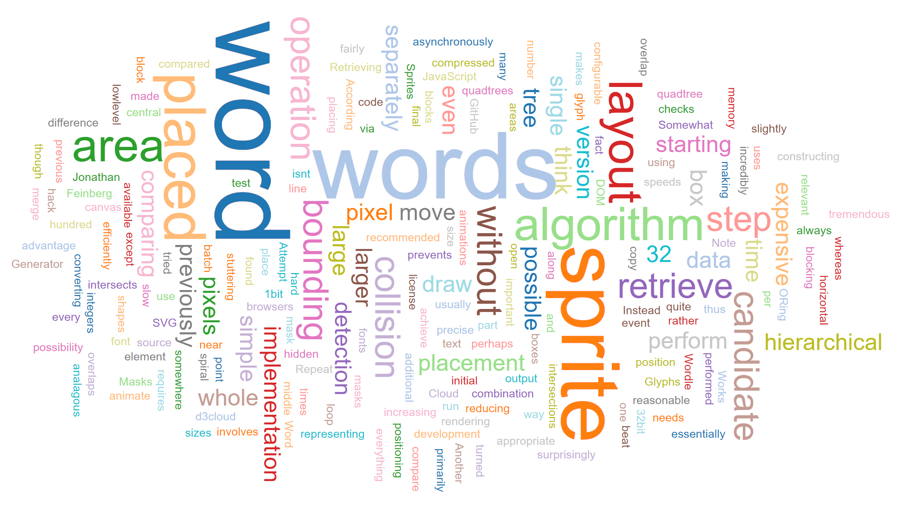

# wordcloud
This project visualizes the words of a text file in a word cloud.
It is based upon the work of [Jason Davies](https://www.jasondavies.com/wordcloud/).

# usage
1. Put the text file in the same directory as the html file.
1. Start a web server: `python -m http.server 8000`
1. In your browser goto `localhost:8000`

# example output

